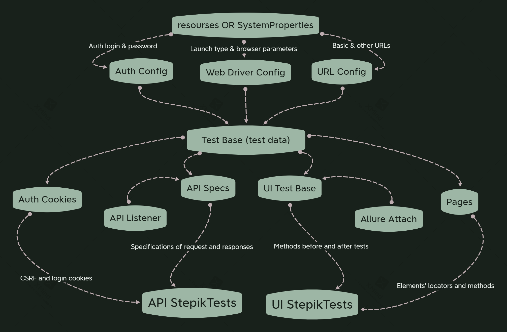
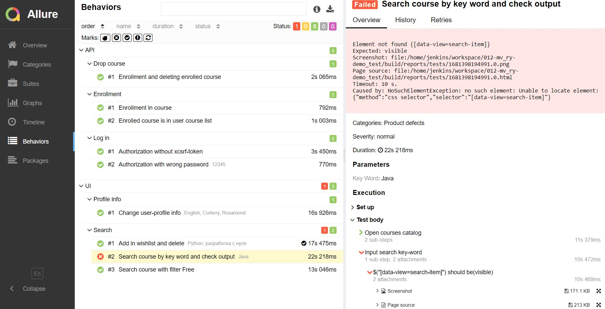
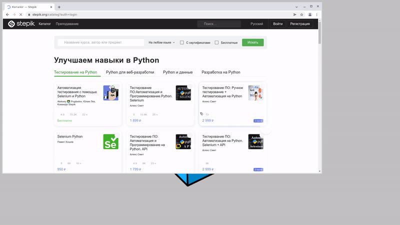
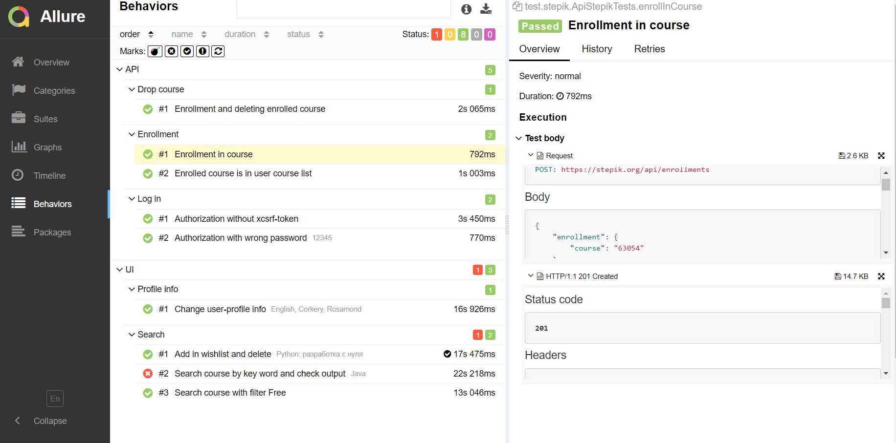
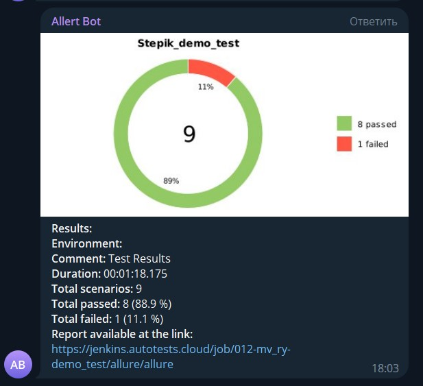

<h2>Demo Project</h2>
<p>A small project to demonstrate my skills:<br>
<i>Prepared after studies in QAguru</i></p>
<p><a href="https://stepik.org/"></a></p>
<h4> Tools and instruments</h4>
<p> 
<a href="https://www.jetbrains.com/idea/"></a>
<a href="https://www.java.com/"></a>
<a href="https://gradle.org/"></a>
<a href="https://junit.org/junit5/"></a>
<a href="https://selenide.org/"></a>
<a href="https://aerokube.com/selenoid/"></a>
<a href="https://rest-assured.io/"></a>
<a href="https://www.jenkins.io/"></a>
<a href="https://github.com/allure-framework/allure2"></a>
<a href="https://qameta.io/"></a>
<a href="https://github.com/qa-guru/allure-notifications"></a><br>
</p>

<h4>UI Tests</h4>
<h5>Tests</h5>
<p> Search by key word<br>
 Search with filters<br>
 Change profile info<br>
 Add course in wishlist</p>

<h5>Key features</h5>
<p> Local or remote launch<br>
 Page Object approach<br>
 Lambda steps<br>
 Data randomizer</p>


<h4>API Tests</h4>
<h4> Tools and instruments</h4>
<p>

<h5>Tests</h5>
<p> Valid and invalid authorization<br>
 Enrolment on course <br>


<h5>Key features</h5>
<p> Specifications for requests and responses<br>
 Customized allure report<br>
 Handling CSRF-cookies<br>


<h4>How it works</h4>
<p> </p>

<h3>How to launch</h3>
<h4>Jenkins
<a href="https://www.jenkins.io/"></a></h3>
Configured jenkins job is<a href="https://jenkins.autotests.cloud/job/012-mv_ry-demo_test/"> here</a>
<p>1. Choose "Parametrized build"<br>
<br><br><br>
2. Select parameters (browser and window size)<br>
<br><br>
</p>

<h4>Local launch</h4>
For local launch through terminal, please, insert command:
```
gradle clean test
```
<p> For local launch authorization data is needed in auth.properties. Otherwise, all tests requiring authorization will be failed </p>

<h3>Using Allure TestOps <a href="https://qameta.io/"></a></h3>
Allure TestOps Project is <a href="https://allure.autotests.cloud/project/2162/test-cases/"> here</a>
<p>In "Test Cases" select tests and click "Run"<br>
<br><br>
<br>TestOps starts Jenkins build. It is possible to observe build in progress. Test cases are renewed automatically if any changes happened
</p>

<h4>  Enjoy reports</h4>
<p> 
Overall Allure Report <br>
<br><br>
<h4>For UI Tests</h4>
<p>
Outlining failing steps<br>
<br><br>
<br>Showing tests in progress<br>
<br>
</p>
<h4>For API Tests</h4>
<p>
Representing requests and responses with body and headers<br>
<br>
</p>
<h4>Telegram notifications <a href="https://github.com/qa-guru/allure-notifications"></a><br></h4>
<p>After building in Jenkins, Telegram notification with results is sent by Telegram bot<br>
<br></p>


